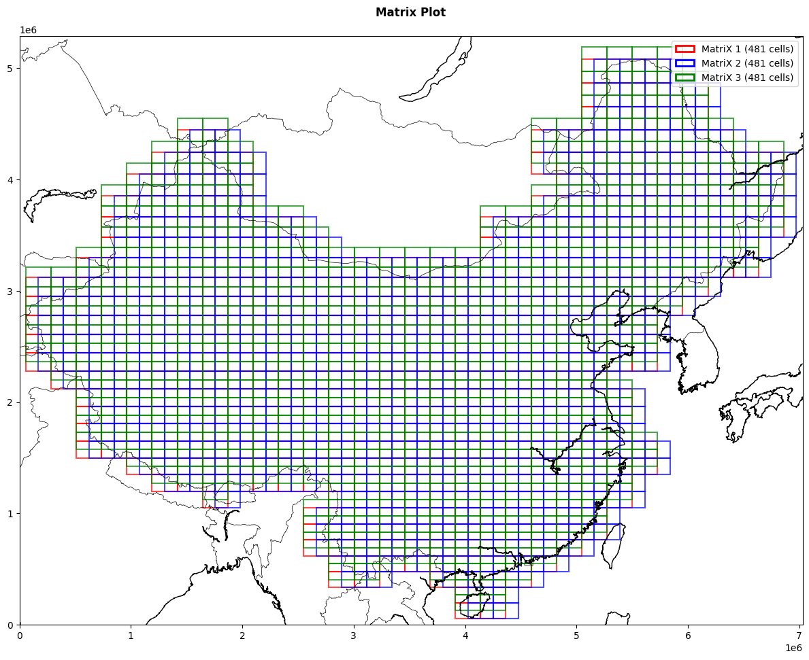
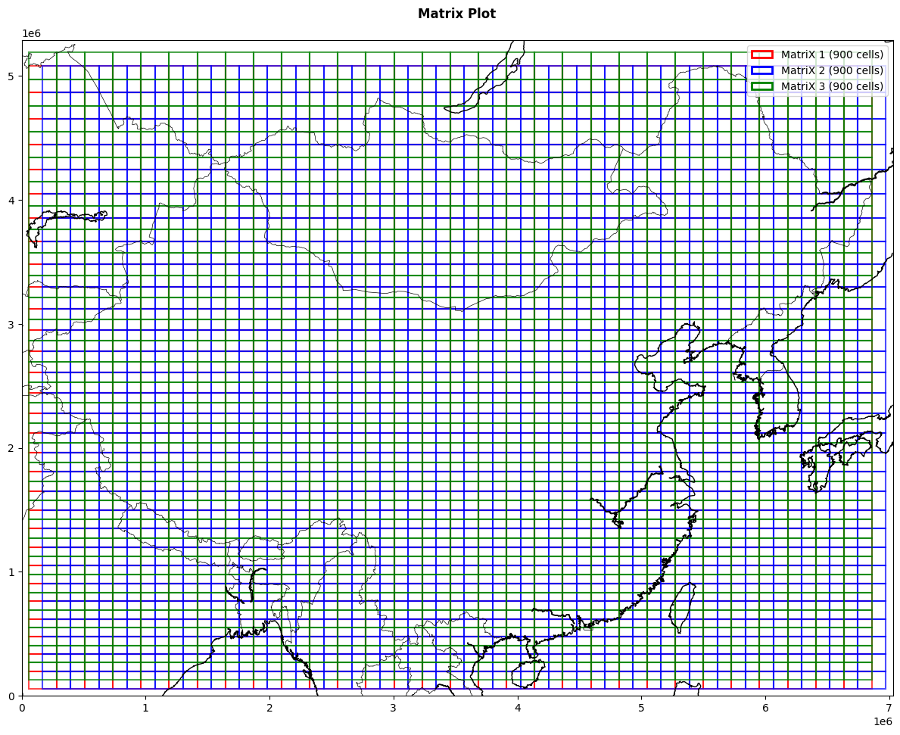

# Spatial Data Base Creator — General Country

This repository provides a Python-based framework for generating structured spatial databases from country boundary data or rectangular giving boundaries and cell count. Spatial data base is used for spatio temporal coexistence search.

- input: rectangular boundaries or country json filename (add json to data folder), cell count vertical and horizontal.
- output: CSV with df results, main and shifted. Plots for visualization
  
---

## Main Features

- Country boundary matrix generation  
- Rectangular spatial grid creation  
- Automated spatial data processing  
- Structured outputs for GIS and database integration

---

## How to run?

- python main_country_matrix.py (set variables in file)
- python main_rectangular_matrix.py (set variables in file)

---

## Results (Example)
### Country

### General

